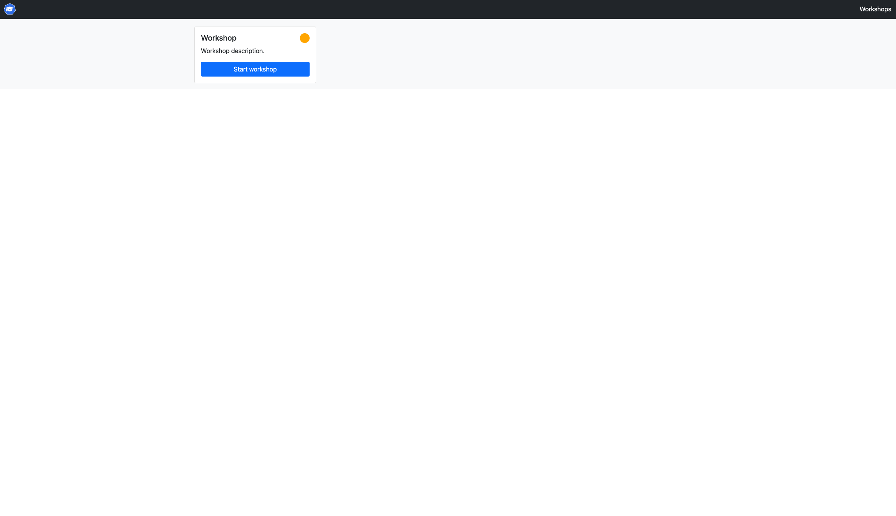

# Getting Started

Educates workshop repositories need to follow a **specific layout** in order for
Educates to **render** instructions, **setup** workshop environments, and **configure**
the workshop itself correctly.

## Bootstrapping a New Workshop

To help us get this setup right, the Educates CLI provides a bootstrapping command:

```sh title="Bootstrap a new Educates workshop repository"
educates new-workshop ./demo-workshop
```

This will create a new workshop called `demo-workshop` in `./demo-workshop`.
The layout of the directory looks like this - click on the annotations for
more information regarding the different files:

```{ .sh .no-copy title="Layout of an Educates workshop" }
demo-workshop
├── README.md # (1)!
├── resources # (2)!
│   └── workshop.yaml
└── workshop # (3)!
    ├── config.yaml # (4)!
    └── content # (5)!
        ├── 00-workshop-overview.md
        ├── 01-workshop-instructions.md
        └── 99-workshop-summary.md
```

1. A `README.md` for us to describe the workshop.
2. The `resources/` folder contains the _Kubernetes resources_ needed for this workshop -
   for now that's just the `Workshop` CustomResource declared in `workshop.yaml`, which
   defines the workshop itself.
3. The `workshop/` folder contains the _workshop resources_ to be used _within_ a workshop
   session.
4. The `config.yaml` where we could configure certain things specific
   to our workshop sessions, as well as navigation order of our content.
5. The `content/` folder with our actual, written content in Markdown. It
   may also include more nested directories to structure content further.

## Writing Workshop Content

The contents in `workshop/content/**/*.md` are what's going to get rendered into our workshop
instructions **from Markdown**.

As rendering is done by [Hugo](https://gohugo.io), its whole range of Markdown syntax is supported
within Educates.

### Text Styling

The most important styling options are supported, as are links:

```md title="Text styling in Educates"
You can write _italic_, **bold**, `monospace`, and ~~strikethrough~~.

[Source](https://www.markdownguide.org/tools/hugo/)
```

gets interpreted as:

> You can write _italic_, **bold**, `monospace`, and ~~strikethrough~~.
>
> [Source](https://www.markdownguide.org/tools/hugo/)

### Listings

Listings work the same, including nested lists and task lists:

```md title="Listings in Educates"
1. Create a workshop on workshops
2. Build a workshop in the workshop on workshops
3. ???
    1. ????
    2. more ?????
4. Profit!
---
- Create a workshop on workshops
- Build a workshop in the workshop on workshops
- ???
    - ????
    - more ?????
- Profit!
---
- [x] Create a workshop on workshops
- [ ] Build a workshop in the workshop on workshops
- [ ] ???
    - [ ] ????
    - [ ] more ?????
- [ ] Profit!
```
gets interpreted as:

> 1. Create a workshop on workshops
> 2. Build a workshop in the workshop on workshops
> 3. ???
>     1. ????
>     2. more ?????
> 4. Profit!
> ---
> - Create a workshop on workshops
> - Build a workshop in the workshop on workshops
> - ???
>     - ????
>     - more ?????
> - Profit!
> ---
> - [x] Create a workshop on workshops
> - [ ] Build a workshop in the workshop on workshops
> - [ ] ???
>     - [x] ????
>     - [ ] more ?????
> - [ ] Profit!

## Publishing Workshop Content

Once we're satisfied with our instructions, we will have to publish them,
according to the [workflow](../about/workflow.md) explained earlier.

To do this, we issue the following command from our workshop's root directory:

```sh title="Publish a workshop to an OCI registry"
educates publish-workshop
```

We can see all relevant content being bundled and pushed to our local OCI registry
running on `localhost:5001`:

``` { .text .no-copy title="Output of the Educates CLI" }
educates publish-workshop

Processing workshop with name "demo-workshop".
Publishing workshop files to "localhost:5001/demo-workshop-files:latest".
dir: .
file: .gitignore
file: README.md
dir: resources
file: resources/workshop.yaml
dir: workshop
file: workshop/config.yaml
dir: workshop/content
file: workshop/content/00-workshop-overview.md
file: workshop/content/01-workshop-instructions.md
file: workshop/content/99-workshop-summary.md
Pushed 'localhost:5001/demo-workshop-files@sha256:5764070c05edb8625eb58393a77676df0029f30d7c33cd1b6a5a6ce7e7800138'
```

## Deploying a Workshop

After publishing, it's time to deploy our workshop to our clusters - again
with the help of the Educates CLI:

```sh title="Deploy a workshop to a cluster"
educates deploy-workshop
```

Again, the CLI outputs useful information, e.g. the **name** of the deployed
workshop as well as the target `TrainingPortal` it got deployed to:

``` { .text .no-copy title="Output of the Educates CLI" }
educates deploy-workshop

Loaded workshop "educates-cli--demo-workshop-efb97a1".
Creating new training portal "educates-cli".
Workshop added to training portal.
```
!!! info "Creation of TrainingPortals"
    Upon the first deployment of a workshop to our local environment, the Educates
    CLI will automatically create a `TrainingPortal` called `educates-cli` for us.

## Opening a TrainingPortal

In the final step of this section, we want to access the `TrainingPortal` which
the Educates CLI has just created for us.

We can wait for the successful creation of the web app workload within our
cluster and have it opened in our browsers for us with the following command:

```sh title="Open an Educates TrainingPortal in the browser"
educates browse-workshops
```

You might see this output and have to wait for a few seconds, but eventually,
a browser window should open:

``` { .text .no-copy title="Output of the Educates CLI"}
educates browse-workshops

Training portal "educates-cli".
Checking training portal is ready.
[/] Waiting...
```

You should be greated by this screen:



We did it! Within a few minutes, we deployed the first draft of our workshops!

Let's learn how we can do _even_ better.